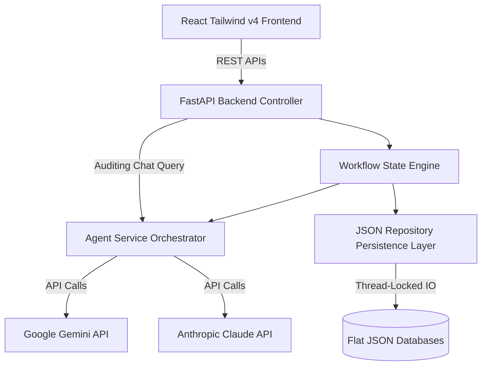

# 🤝 Agentic Procurement Simulator

A state-of-the-art, multi-agent business simulation demonstrating automated procurement negotiations between a Buyer (**MegaMart Online**, powered by Google Gemini) and a Supplier (**FreshFizz Consumer Products**, powered by Anthropic Claude). 

The platform provides full **Human-in-the-Loop (HITL)** governance, real-time CPG inventory synchronization, cost-savings analytics, and an interactive AI Auditing companion.

---

## 💡 Executive Pitch & Value Proposition (For Presentation/Demo)
In enterprise supply chains, procurement is historically bogged down by manual back-and-forth email negotiations, spreadsheet version conflicts, and compliance gaps. The **Agentic Procurement Simulator** demonstrates how AI Agents can autonomously negotiate complex contracts, check inventory availability, request volume discounts, and handle SKU-level counter-offers—all while leaving the human operator in control as the final approver (HITL).

### Key Business Value Drivers:
1. **Accelerated Sourcing Cycles**: Reduces negotiation loop times from weeks to minutes.
2. **Cost Optimization**: Auto-proposes discount structures based on historical benchmarks.
3. **Closed-Loop Automation**: Automatically binds stock levels to purchase orders (Catalog Alerts -> Auto-Replenishment -> Closed Deal).
4. **Compliance & Audit Readiness**: Dynamically generates transaction scorecards and provides a conversational **AI Negotiation Auditor** to trace agent decisions.

---

## 🚀 Key Features

* **Multi-Agent Negotiation Orchestration**: Features collaborative dialogue between Gemini (acting as the buyer) and Claude (acting as the supplier) negotiating quantities, prices, and terms.
* **6-Step Procurement Lifecycle**:
  1. **Material Request Quote (MRQ)**: Buyer drafts a product requisition outlining desired products and quantities.
  2. **Fulfillment Proposal**: Supplier reviews stock levels and quotes pricing based on the current product catalog.
  3. **Buyer Negotiation**: Buyer proposes counter-offers requesting 3–5% discounts and adjusts quantities.
  4. **Supplier Counter-Proposal**: Supplier reviews the counter-offer at the SKU level, accepting some discount lines and rejecting others (e.g. setting custom raw goods back to original quoted rates).
  5. **Buyer Final Acceptance**: Buyer reviews the final counter-proposal and accepts or declines SKUs at the line-item level.
  6. **PO & Invoicing**: Auto-generates final contracts (Purchase Order, Commercial Invoice, Delivery Order), decrements inventory levels, and prompts Gemini to compile a transaction narrative report.
* **Human-In-The-Loop Governance**: Operators can edit draft letters, change quantities/prices, and toggle SKU-level active status directly in the UI before approving and sending documents.
* **Cost-Savings & Negotiation Scorecard**: On completion (Step 6), displays a premium scorecard with critical metrics: total dollars saved, fulfillment success rates, value change comparisons, and item-by-item savings breakdowns.
* **AI Negotiation Auditor (Interactive Chat)**: Clickable Run IDs dynamically open a detailed 6xl modal with the compiled markdown report on the left, and a **Live conversational chat with Gemini** on the right. Ask Gemini questions about savings, inventory levels, or why specific items were rejected.
* **Low-Stock Auto-Replenishment Alarm**: A threshold monitor in the Catalog tab flags products falling below safety levels (< 200 units) and enables a one-click auto-populated MRQ simulation trigger to restore warehouse stock.
* **Zero-Configuration Mock Fallback**: The simulator runs out-of-the-box in a local mock-mode, permitting full pipeline execution even if LLM API keys are omitted. The mock mode is randomized to ensure high-fidelity demo presentations.

---

## 🏗️ Technical Architecture

The application adheres to **Clean Architecture** and **SOLID Design Principles** to ensure modularity and ease of maintainability.



### Stack Components:
1. **Frontend**: Vite, React, TypeScript, Tailwind CSS v4, Lucide Icons.
2. **Backend**: FastAPI, Python 3.12, Pydantic v2.
3. **Databases**: Local flat JSON repositories protected by a global threading lock to prevent race conditions.

---

## 📂 Project Structure

```
├── backend/                   # FastAPI Web Service
│   ├── app/
│   │   ├── core/              # Prompts and configuration settings
│   │   ├── models/            # Pydantic data schemas (Product, Quote, State)
│   │   ├── repositories/      # Concurrency-safe JSON database readers/writers
│   │   ├── services/          # Workflow state machines & LLM callers
│   │   └── main.py            # API controller routing endpoints
│   └── requirements.txt       # Python package dependencies
├── frontend/                  # React Single Page Application (SPA)
│   ├── src/
│   │   ├── components/        # Layout tabs (Navbar, Dashboard, Simulator, Catalog, Admin, Settings)
│   │   ├── services/          # Type-safe API fetch client
│   │   ├── App.tsx            # Main layout router
│   │   └── index.css          # Tailwind CSS directives & scrollbar definitions
│   ├── vite.config.ts         # Vite bundler options
│   └── tsconfig.app.json      # TypeScript compiler guidelines
├── data/                      # Database storage (created dynamically)
│   ├── products.json          # Live product catalog
│   ├── inventory.json         # Stock levels
│   └── history.json           # Completed negotiation records
├── start.sh                   # Unified startup launcher script
└── README.md                  # System overview and instruction manual
```

---

## 🏁 Getting Started

### Prerequisites
* **Python**: Python 3.12+
* **Node.js**: Node 18+

### Setup and Execution

1. Clone or navigate to the project directory:
   ```bash
   cd Agentic-Procurement
   ```
2. Make the launcher script executable:
   ```bash
   chmod +x start.sh
   ```
3. Run the startup script:
   ```bash
   ./start.sh
   ```

The script will automatically:
* Locate and activate your python virtual environment at `/Users/paragjain/dev-works/myenv`.
* Verify and install python dependencies in `backend/requirements.txt`.
* Install frontend dependencies and build the production bundle (`npm run build`).
* Boot up the FastAPI backend on port `8000`.
* Serve the React application via Vite preview on port `5173`.
* Open your default browser to `http://localhost:5173/`.

---

## 🎬 Live Demo Script (Step-by-Step Presentation Guide)

Follow this guide to deliver a compelling live product demonstration:

### Part 1: Auto-Replenishment & MRQ Launch
1. Open the browser to the simulator home page. Navigate to the **Catalog** tab.
2. Highlight the **"Stock Shortage Alert"** banner at the top showing items below safety limits. Note the pulsing amber dots indicating low stock levels on target SKUs.
3. Click the **"Trigger Auto-Replenishment Run"** button. Explain that the system is capturing the inventory gap, calculating order volumes to meet MOQ, and packaging an MRQ.
4. You will be redirected to the **Simulator** tab. Step 1 is now active, populated with the specific low-stock products.
5. Review the Buyer's draft letter. Explain that operators have full editing capabilities before approval. Click **Approve & Send**.

### Part 2: Agent Sourcing & Fulfillment Proposal
1. Explain that the supplier agent (Claude) has received the request, verified warehouse stock levels, and generated a price quote.
2. Step 2 shows the Supplier's proposal. Notice that any items with zero stock are flagged as "0% fulfilled" in the table and letter text.
3. Click **Approve & Send**.

### Part 3: SKU-Level Discount Negotiation
1. Step 3 initiates. The buyer agent (Gemini) proposes a counter-proposal applying volume discount targets (e.g. 4% off).
2. Click **Approve & Send**.
3. In Step 4, the supplier agent (Claude) reviews the discounts at the SKU level. Explain that the supplier randomizes outcomes for realistic demo dynamics.
4. Point out the letter text: Claude has approved discounts for some lines, but rejected others due to profit margins. The table pricing updates automatically. Click **Approve & Send**.

### Part 4: Line-Item Approval & Contract Signoff
1. In Step 5, the buyer reviews Claude's counter-proposal.
2. Demonstrate **HITL SKU controls**: Toggle the **Accept/Decline** buttons next to individual products in the table. Show that declining an SKU reduces its quantity to 0 and updates the total contract value.
3. Click **Approve & Send**.
4. Step 6 finishes the negotiation. The screen reveals a beautiful **Cost Savings Dashboard** displaying:
   * Fulfillment Rate percentage.
   * Total dollars saved (e.g. `$350.00`).
   * A side-by-side table mapping initial requested quantities/prices to negotiated quantities/prices.
   * Final binding documents (PO, Commercial Invoice, Delivery Order).
5. Explain that warehouse inventory levels are now decremented in real-time. Navigate back to the **Catalog** tab to show the replenished inventory and cleared alerts.

### Part 5: AI Negotiation Auditor (Conversational Compliance)
1. Navigate to the **Dashboard** tab. Show the completed run list.
2. Click on the completed Run ID (e.g., `WF-A27EDE`).
3. Point out the dual-pane modal:
   * **Left Panel**: Narrative summary generated by Gemini.
   * **Right Panel**: Conversational AI Auditor chatbot.
4. Type a question in the Auditor input: *"Why did the supplier refuse the discount on RoastedAlmonds?"* or *"What was our total savings?"*.
5. Watch Gemini instantly compile a detailed analyst answer based on the log records.
