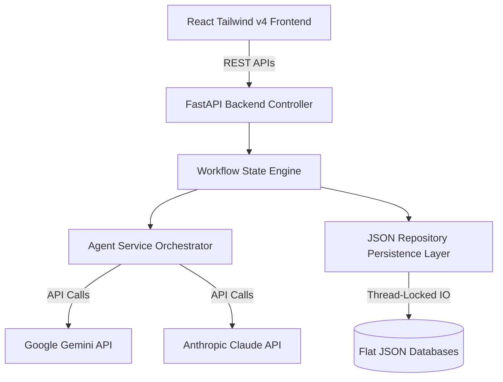

# 🤝 Agentic Procurement Simulator

A state-of-the-art, multi-agent business simulation demonstrating automated procurement negotiations between a Buyer (**MegaMart Online**, powered by Google Gemini) and a Supplier (**FreshFizz Consumer Products**, powered by Anthropic Claude). 

The platform provides full **Human-in-the-Loop (HITL)** governance, real-time CPG inventory synchronization, and AI-driven high-level transaction summaries. This is by design to demostrate the real Agentic capabilties, However, in this case i have put Humam in the loop at each step as this is only a simulator. 

---

## 🚀 Key Features

* **Multi-Agent Negotiation Orchestration**: Features collaborative dialogue between Gemini (acting as the buyer) and Claude (acting as the supplier) negotiating quantities, prices, and terms.
* **6-Step Procurement Lifecycle**:
  1. **Material Request Quote (MRQ)**: Buyer drafts a product requisition outlining desired products and quantities.
  2. **Fulfillment Proposal**: Supplier reviews stock levels and quotes pricing based on the current product catalog.
  3. **Buyer Negotiation**: Buyer proposes counter-offers requesting 3–5% discounts and adjusts quantities.
  4. **Supplier Counter-Proposal**: Supplier reviews the counter-offer at the SKU level, accepting some discount lines and rejecting others (e.g. setting custom raw goods back to original quoted rates).
  5. **Buyer Final Acceptance**: Buyer reviews the final counter-proposal and accepts or declines SKUs at the line-item level.
  6. **PO & Invoicing**: Auto-generates final contracts (Purchase Order, Commercial Invoice, Delivery Order), decrements inventory levels, and prompts Gemini to compile a transaction narrative report.
* **Human-In-The-Loop Governance**: Operators can edit draft letters, change quantities/prices, and toggle SKU-level active status directly in the UI before approving and sending documents.
* **Clickable Run Reports**: Workflow Run IDs are clickable links that dynamically call Gemini to compile a high-level summary report detailing pricing decisions, negotiated savings, and shipping schedules.
* **Zero-Configuration Mock Fallback**: The simulator runs out-of-the-box in a local mock-mode, permitting full pipeline execution even if LLM API keys are omitted.
* **Concurrency-Safe Flat JSON DB**: Uses a thread-locked repository layer to handle concurrent requests safely without SQL server setups.

---

## 🏗️ Technical Architecture

The application adheres to **Clean Architecture** and **SOLID Design Principles** to ensure modularity and ease of maintainability.



### Stack Components:
1. **Frontend**: Vite, React, TypeScript, Tailwind CSS v4, Lucide Icons.
2. **Backend**: FastAPI, Python 3.12, Pydantic v2.
3. **Databases**: Local flat JSON repositories protected by a global threading lock to prevent race conditions.

---

## 📂 Project Structure

```
├── backend/                   # FastAPI Web Service
│   ├── app/
│   │   ├── core/              # Prompts and configuration settings
│   │   ├── models/            # Pydantic data schemas (Product, Quote, State)
│   │   ├── repositories/      # Concurrency-safe JSON database readers/writers
│   │   ├── services/          # Workflow state machines & LLM callers
│   │   └── main.py            # API controller routing endpoints
│   └── requirements.txt       # Python package dependencies
├── frontend/                  # React Single Page Application (SPA)
│   ├── src/
│   │   ├── components/        # Layout tabs (Navbar, Dashboard, Simulator, Catalog, Admin, Settings)
│   │   ├── services/          # Type-safe API fetch client
│   │   ├── App.tsx            # Main layout router
│   │   └── index.css          # Tailwind CSS directives & scrollbar definitions
│   ├── vite.config.ts         # Vite bundler options
│   └── tsconfig.app.json      # TypeScript compiler guidelines
├── data/                      # Database storage (created dynamically)
│   ├── products.json          # Live product catalog
│   ├── inventory.json         # Stock levels
│   └── history.json           # Completed negotiation records
├── start.sh                   # Unified startup launcher script
└── README.md                  # System overview and instruction manual
```

---

## 🏁 Getting Started

### Prerequisites
* **Python**: Python 3.12+
* **Node.js**: Node 18+

### Setup and Execution

1. Clone or navigate to the project directory:
   ```bash
   cd Agentic-Procurement
   ```
2. Make the launcher script executable:
   ```bash
   chmod +x start.sh
   ```
3. Run the startup script:
   ```bash
   ./start.sh
   ```

The script will automatically:
* Locate and activate your python virtual environment at `/Users/paragjain/dev-works/myenv`.
* Verify and install python dependencies in `backend/requirements.txt`.
* Install frontend dependencies and build the production bundle (`npm run build`).
* Boot up the FastAPI backend on port `8000`.
* Serve the React application via Vite preview on port `5173`.
* Open your default browser to `http://localhost:5173/`.

---

## ⚙️ Configuration & Management

* **AI Models & API Keys**: Open the **Settings** tab in the UI to manage API keys for Google Gemini and Anthropic Claude, as well as select model versions.
* **Database Maintenance**: Open the **Admin** tab to rebuild the product catalog, reset stock levels, or import/export system backups.
