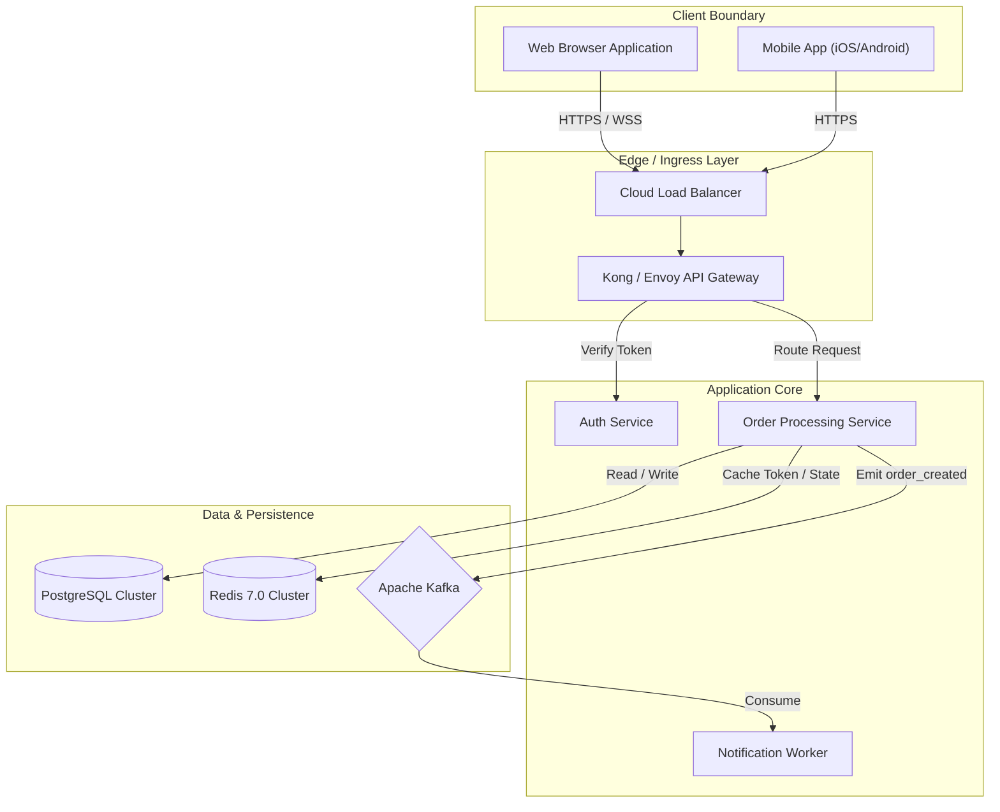
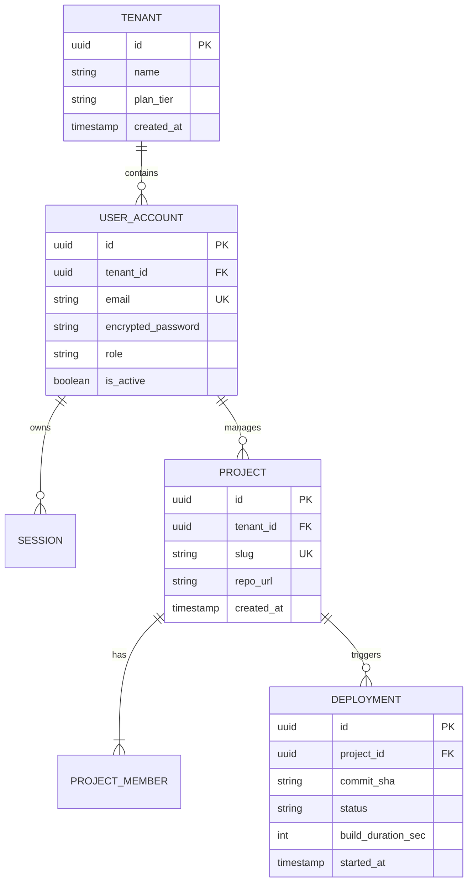
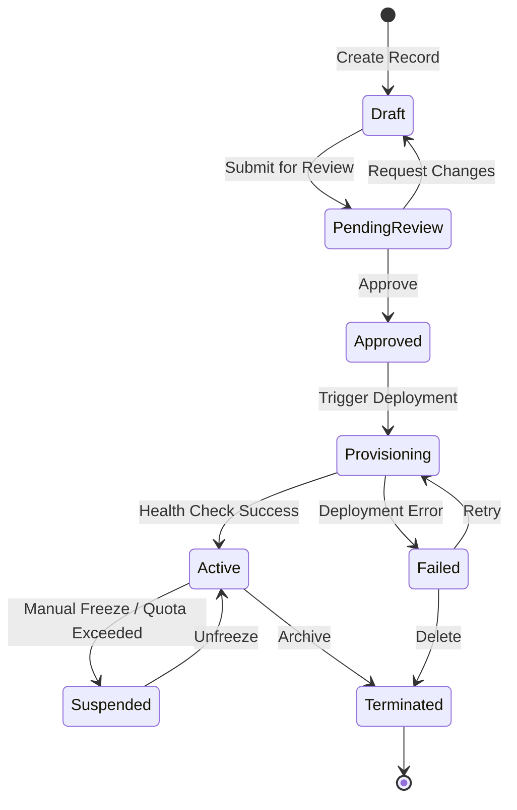

## Contents
- General Formatting Guidelines
- System Architecture & Block Diagrams (graph TD)
- Sequence Diagrams (sequenceDiagram)
- Entity Relationship Diagrams (erDiagram)
- State Diagrams (stateDiagram-v2)
- Common Pitfalls & Forbidden Syntax

---

## General Formatting Guidelines
1. **Always use strict code blocks:** Open Mermaid blocks with ` ```mermaid ` and terminate with ` ``` `.
2. **Safe Entity Identifiers:** Use alphanumeric IDs for nodes without whitespace or special characters (e.g., `APIGW`, `WorkerPool`, `DB_Primary`).
3. **Escaped Node Labels:** When displaying text with spaces, punctuation, routes, or brackets, wrap the label in double quotes:
   - Correct: `NodeA["API Gateway (/api/v1)"]`
   - Incorrect: `NodeA[API Gateway (/api/v1)]`
4. **Avoid Prohibited Characters in Labels:** Do not use unescaped double quotes, raw angle brackets without quotes, or raw semicolons inside label strings.

---

## System Architecture & Block Diagrams (graph TD)

Use `graph TD` (top-down) or `graph LR` (left-to-right) for component interactions, data pipelines, and service topologies.

### Preferred Patterns
- Group related systems using `subgraph`.
- Specify explicit shapes: `[...]` for services/processes, `[(...)]` for datastores, `{...}` for decision points/queues.



---

## Sequence Diagrams (sequenceDiagram)

Use `sequenceDiagram` for request lifecycles, event cascades, and complex multi-service interactions.

### Preferred Patterns
- Always enable `autonumber` on line 2.
- Explicitly declare `actor` and `participant` with aliases.
- Use `alt`/`else`/`end`, `opt`/`end`, and `loop`/`end` for branching logic.
- Differentiate synchronous calls (`->>`) from asynchronous messages (`-->>` or `-x`).

```mermaid
sequenceDiagram
    autonumber
    actor Client as Web Frontend
    participant Auth as Auth Middleware
    participant Controller as Order Controller
    participant Service as Order Service
    participant DB as Postgres DB
    participant Broker as Kafka Broker

    Client->>Auth: POST /orders (Bearer Token, Payload)
    Auth->>Auth: Validate JWT Signature & Expiry
    alt Token Invalid
        Auth-->>Client: 401 Unauthorized
    else Token Valid
        Auth->>Controller: Forward with User Context
        Controller->>Service: CreateOrder(ctx, req)
        Service->>DB: BEGIN TRANSACTION; INSERT order
        DB-->>Service: Transaction Committed
        Service->>Broker: Publish "order.created"
        Broker-->>Service: ACK
        Service-->>Controller: OrderDTO
        Controller-->>Client: 201 Created (Order Summary JSON)
    end
```

---

## Entity Relationship Diagrams (erDiagram)

Use `erDiagram` to model database tables, ORM models, collections, and relations.

### Cardinality Syntax
- `||--||` : Exactly one to exactly one
- `||--|{` : Exactly one to one or more
- `||--o{` : Exactly one to zero or more
- `}|--|{` : One or more to one or more



---

## State Diagrams (stateDiagram-v2)

Use `stateDiagram-v2` for state machines, entity lifecycles, and deployment status progressions.



---

## Common Pitfalls & Forbidden Syntax

| Forbidden Pattern | Reason | Corrected Pattern |
| :--- | :--- | :--- |
| `Node[API Gateway: v1]` | Raw colons inside brackets break parser | `Node["API Gateway: v1"]` |
| `User -> Gateway` | Incorrect arrow syntax for `graph` (spaces, single dash) | `User --> Gateway` |
| `A --> B: Text on arrow` | Colons on arrows only valid in sequence diagrams | `A -->|Text on arrow| B` |
| Nested quotes `["Value "sub" text"]` | Breaks string parsing | `["Value 'sub' text"]` |
| `erDiagram` with spaces in entity names | Entities must be single words/underscores | `CUSTOMER_ORDER` instead of `Customer Order` |
