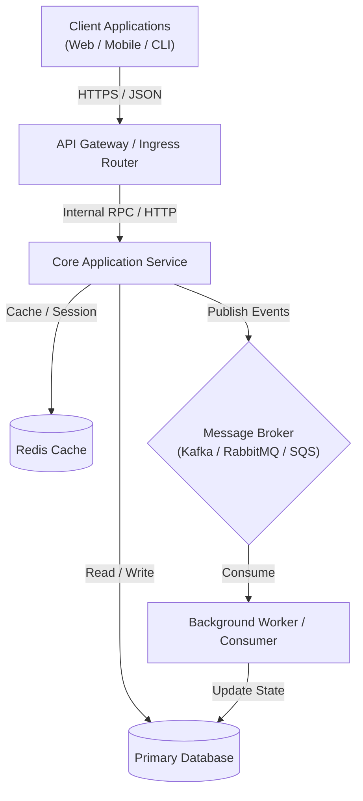
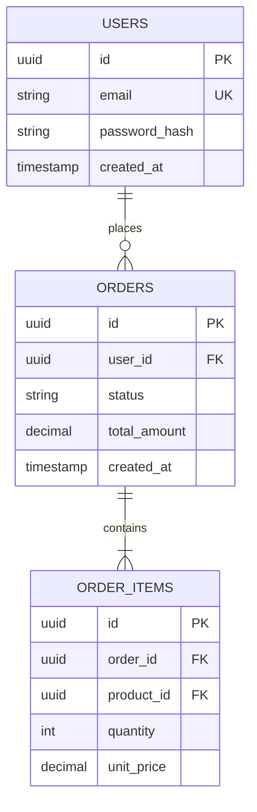
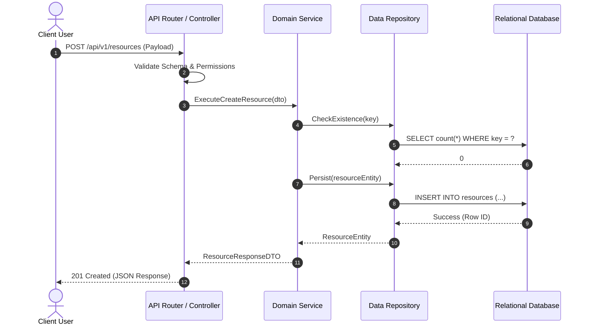
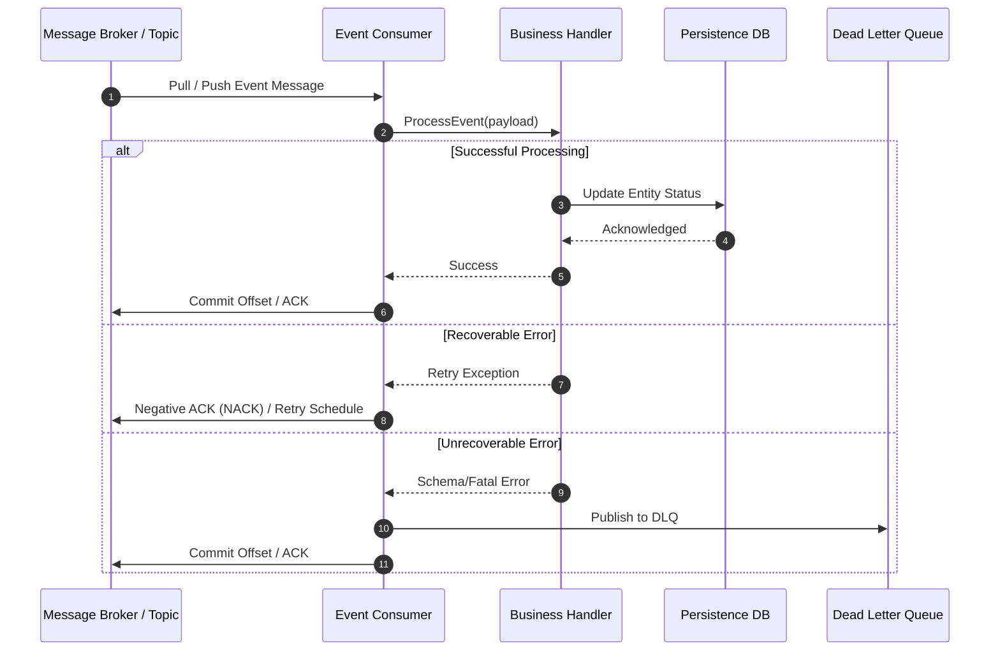

# Technical Design Document: <System/Service Name>

**Document Status:** Approved | Under Review | Draft  
**Target Repository:** `<repository-name>`  
**Generated Date:** `<YYYY-MM-DD>`  
**Authors / Maintainers:** `<Authors / Team>`

---

## 1. System Overview

### 1.1 Executive Summary
A concise summary of what the system does, the business problem it solves, and the primary stakeholders or consumers.

### 1.2 System Objectives & Non-Objectives
- **In-Scope Objectives:**
  - Objective 1: Primary functional requirement fulfilled by this codebase.
  - Objective 2: Latency, throughput, or operational goal.
- **Out-of-Scope (Non-Objectives):**
  - Boundary 1: Capabilities explicitly delegated to external systems or future phases.

---

## 2. High-Level Architecture

### 2.1 System Context Diagram


### 2.2 Architectural Pattern & Tech Stack Summary
- **Architecture Style:** (e.g., Modular Monolith, Microservices, Event-Driven Consumer, Serverless Pipeline)
- **Primary Languages & Runtimes:** (e.g., Python 3.11, Node.js 20 / TypeScript, Go 1.22)
- **Frameworks:** (e.g., FastAPI, Next.js, Gin, Spring Boot)
- **Datastores & Caches:** (e.g., PostgreSQL 15, Redis 7)
- **Messaging & Event Streaming:** (e.g., Apache Kafka, RabbitMQ, AWS SQS)

---

## 3. Component Breakdown & Module Architecture

### 3.1 Component Directory Map
```
<root_directory>/
├── src/api/          # HTTP handlers, controllers, route definitions
├── src/core/         # Business logic, domain services, orchestration
├── src/models/       # ORM definitions, entities, schemas
├── src/repository/   # Data access layer, query builders
├── src/workers/      # Background jobs, message consumers
└── src/config/       # Environment settings, telemetry, initializers
```

### 3.2 Core Components & Responsibilities

#### Component 1: `<Module/Service Name>`
- **Path:** `<file_or_directory_path>`
- **Responsibilities:** Key domain logic and processing executed by this component.
- **Key Classes / Interfaces / Structs:**
  - `EntityService`: Coordinates transactions and domain validations.
  - `EntityRepository`: Manages queries against the persistence layer.
- **Dependencies:** Consumes `DatabaseClient`, `CacheManager`.
- **Error Handling Strategy:** Catches domain exceptions and maps them to standard domain errors.

#### Component 2: `<Module/Service Name>`
- **Path:** `<file_or_directory_path>`
- **Responsibilities:** Key domain logic and processing executed by this component.
- **Key Classes / Interfaces / Structs:**
  - `WorkerConsumer`: Polls queue and executes idempotent handlers.
- **Dependencies:** Consumes `MessageBrokerClient`, `ThirdPartyApiClient`.

---

## 4. API & Interface Specifications

### 4.1 REST / HTTP Endpoints

| Method | Endpoint | Description | Request Body / Params | Response Codes | Auth Required |
| :--- | :--- | :--- | :--- | :--- | :--- |
| `POST` | `/api/v1/resources` | Create a new resource record | JSON payload with resource attributes | `201 Created`, `400 Bad Request`, `401 Unauthorized` | Bearer JWT |
| `GET` | `/api/v1/resources/{id}` | Fetch resource by unique ID | Path param: `id` (UUID) | `200 OK`, `404 Not Found` | Bearer JWT |
| `PUT` | `/api/v1/resources/{id}` | Update existing resource | Path param: `id`, JSON update payload | `200 OK`, `400 Bad Request`, `404 Not Found` | Bearer JWT |
| `DELETE` | `/api/v1/resources/{id}` | Soft-delete a resource | Path param: `id` (UUID) | `204 No Content`, `404 Not Found` | Admin Role |

### 4.2 Asynchronous Event Interfaces & Schemas

| Event / Topic Name | Producer | Consumer | Payload Structure | Delivery Guarantee |
| :--- | :--- | :--- | :--- | :--- |
| `order.created.v1` | Order Service | Notification Worker, Inventory Service | JSON `{ "orderId": "uuid", "userId": "uuid", "timestamp": "ISO8601" }` | At-least-once |
| `payment.processed.v1` | Payment Gateway Webhook | Order Service | JSON `{ "paymentId": "uuid", "status": "SUCCESS", "amount": 1000 }` | At-least-once |

---

## 5. Data Architecture & Persistence

### 5.1 Entity-Relationship Model


### 5.2 Storage Technologies & Data Retention
- **Primary Relational Store:** PostgreSQL with ACID transaction guarantees for transactional data.
- **Index & Query Optimization:** B-Tree indices on frequently queried foreign keys (`user_id`, `created_at`).
- **Caching Strategy:** Redis cache-aside pattern with TTL expiration (e.g., 300 seconds for read-heavy resources).

---

## 6. Core Workflows & Execution Sequences

### 6.1 Primary Synchronous Workflow (e.g., Request Handling)


### 6.2 Primary Asynchronous Workflow (e.g., Event Ingestion / Background Job)


---

## 7. Operational, Security & Deployment Considerations

### 7.1 Security & Authentication
- **Authentication:** Token-based (JWT / OAuth2 / API Key) validated at edge or gateway middleware.
- **Authorization:** Role-Based Access Control (RBAC) enforced at router/handler boundaries.
- **Data Protection:** Encryption-at-rest via KMS-managed database storage; TLS 1.3 enforced for in-transit communication.

### 7.2 Reliability & Fault Tolerance
- **Timeouts & Circuit Breaking:** External HTTP calls wrapped in configurable timeouts and retry policies with exponential backoff.
- **Idempotency:** Background workers implement idempotency keys or unique event ID tracking to prevent duplicate execution.

### 7.3 Observability & Monitoring
- **Logging:** Structured JSON logs containing correlation IDs (`trace_id`, `request_id`).
- **Metrics:** Prometheus/OpenTelemetry metrics capturing request count, latency percentiles (p50, p95, p99), and error rates.
- **Health Checks:** Standard `/healthz` (liveness) and `/readyz` (readiness) endpoints inspecting DB connections.
