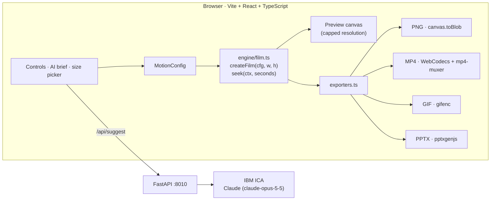

# 🟠 Hero Motion Studio

Turn a few lines of text into an **animated hero for a presentation slide**, then export it as a PNG, MP4, GIF or a ready-made PPTX slide.

A single accent dot carries the whole film. It starts as the knob of a UI toggle, becomes the dot over the **i** in your hero word, draws your stat, grows into a frame-filling shape, sets the kinetic type in motion, dissolves into a halftone field, lands on the end card, and travels back so the loop closes without a seam.

> Revision 1 · prototype. Grew out of `Experiments/orange-dot-motion`, a single-file HTML proof of concept.

---

## Contents

- [Quick start](#quick-start)
- [How to use it](#how-to-use-it)
- [What you can control](#what-you-can-control)
- [Output sizes](#output-sizes)
- [Export formats](#export-formats)
- [The film, scene by scene](#the-film-scene-by-scene)
- [Architecture](#architecture)
- [Project layout](#project-layout)
- [Configuration](#configuration)
- [API](#api)
- [Design rules the engine keeps](#design-rules-the-engine-keeps)
- [Known limits](#known-limits)
- [Roadmap](#roadmap)

---

## Quick start

```bash
cd hero-motion-studio
cp .env.example .env      # add your IBM ICA endpoint and key (only needed for AI copy)
./start.sh
```

| Service | URL |
|---|---|
| Frontend (studio) | http://localhost:5180 |
| Backend (FastAPI) | http://localhost:8010 · docs at `/docs` |

`start.sh` frees both ports, activates the shared venv at `/Users/paragjain/dev-works/myenv`, installs missing Python and npm packages, starts both servers, and writes logs to `logs/`. Press `Ctrl+C` to stop everything.

The studio works without the backend. Only the **Write it with AI** panel needs it.

---

## How to use it

1. **Write the copy.** Type it into the Text fields, or describe the slide in plain words under **Write it with AI** and click **Generate copy**. Claude fills every text slot.
2. **Pick the scenes.** Choose how the stat is shown, which shape plays, and how the words move. You can switch the stat, shape, words or end card off entirely.
3. **Style it.** Pick a theme, an accent colour and a font.
4. **Set the timing.** Drag the loop duration, or click **use it** next to "Designed pace" to get the natural length for the scenes you have on.
5. **Pick a size** above the preview, scrub or jump to key moments, then **Export**.

Settings are saved in the browser, so a reload keeps your work. **Reset** restores the defaults.

Keyboard: `Space` play/pause · `←` / `→` step one frame.

---

## What you can control

| Area | Options |
|---|---|
| **Text** | Intro word · hero word (an `i` or `j` gets the accent dot as its tittle) · stat (the spring graph really overshoots by this %, and counters keep any prefix/suffix such as `$1.2M` or `3.5x`) · 3–6 orbit words · end-card title, subtitle and footnote |
| **Stat style** | Spring graph · Bar chart · Counter · Progress ring |
| **Shape style** | Square → pill · Triangle → circle · Star burst · Blob |
| **Words style** | Orbit · Floating · List (dot is the bullet) · Tags |
| **Scene switches** | Stat, shape, words and end card can each be turned off. The dot bridges the gap. The toggle/hero opening and the return trip always play so the loop closes. |
| **Style** | Themes: warm paper, night, cool grey, navy · accent swatches or any colour · custom background and ink · fonts: Inter Tight, Archivo, Manrope, Sora, Plus Jakarta Sans, Outfit |
| **Timing** | Loop duration 6–30s. The stat and words scenes play slower than the rest so they can be read. |
| **AI copy** | Brief + tone (confident, playful, executive, technical, bold), optional AI accent colour |
| **Sound** | Reserved in the config, not wired up yet |

---

## Output sizes

Every size is a full-bleed render, not a letterbox: the design is scaled to fit, and backgrounds, fills and the halftone always cover the whole frame.

| Size | Pixels | Typical use |
|---|---|---|
| Full slide 16:9 | 1920×1080 | Title or hero slide |
| Full slide 16:9 · 4K | 3840×2160 | Big screens, crisp stills |
| Classic slide 4:3 | 1440×1080 | Older 4:3 decks |
| Half slide 8:9 | 960×1080 | One side of a split layout |
| Square 1:1 | 1080×1080 | Content block beside text |
| Banner 32:9 | 1920×540 | Section header strip |
| Tile 4:3 | 800×600 | Small card in a grid |
| Custom | up to 4096 per side | Anything else |

---

## Export formats

| Format | Details | Best for |
|---|---|---|
| **PNG** | Current preview frame or any key moment (toggle, hero, stat, shape, words, end card) | Static hero or title slide |
| **MP4** | H.264 at 30 or 60 fps, rendered frame by frame (not screen-recorded), so it is smooth and loops exactly | PowerPoint and Keynote, which play it inline |
| **GIF** | 15/20/25 fps, width capped at 480–1280 px, 256 colours | Google Slides, email |
| **PPTX** | One 16:9 slide with the MP4 embedded and a PNG poster frame, or just the still. Non-16:9 sizes are centred on the slide. | Ready-made slide |

MP4 (and video inside PPTX) uses WebCodecs, so it needs Chrome, Edge or Safari 17+.

---

## The film, scene by scene

The engine runs on an internal 15-unit timeline. A timing map stretches or collapses each scene, then scales the result to your chosen duration.

| Internal time | Scene | What happens |
|---|---|---|
| 0.0 – 3.0 | **Open** (always on) | Cursor clicks the toggle, the knob springs across, the intro word bends away, and the hero word grows. The knob flies up and becomes the dot over the **i**. |
| 3.0 – 6.5 | **Stat** · 1.25× slower | The dot jumps off the word and lands in the chosen stat style, which uses the same spring that moves the dot. Then it shoots along a line to the centre. |
| 6.5 – 9.0 | **Shape** | The dot grows past all four corners, the chosen black shape spins and morphs inside it, then everything contracts to a dot on black. |
| 9.0 – 10.75 | **Words** · 1.35× slower | The words appear around the dot in the chosen style. |
| 10.75 – 13.55 | **Reveal / end card** | Letters fly outward into dots, a halftone field grows past the frame edges and flips to ink, and the end card rises. The dot lands on the title's i. |
| 13.55 – 15.0 | **Return** (always on) | The dot travels back through a halftone echo and a small spring curve to the toggle. The last frame matches the first. |

When a scene is switched off, it collapses to a short bridge: for example, with the stat off, the dot hops straight from the hero's i to the centre.

---

## Architecture



- **Pure function of time.** `seek(ctx, seconds)` draws a frame from nothing but the config and the time: no timers, CSS transitions or state between frames. That is what makes the exports exact and the loop seamless.
- **One design space.** Everything is laid out in 1920×1080 and scaled with `u = min(w/1600, h/1080)`. Full-frame effects iterate over the visible design-space rectangle instead.
- **Frame-by-frame export.** MP4 and GIF render each frame offscreen and encode it, faster than real time and independent of the display's refresh rate.
- **Backend is optional.** It only writes copy. All rendering and exporting happens in the browser.

---

## Project layout

```
hero-motion-studio/
├── start.sh                    # one-command startup (ports 8010 / 5180)
├── .env.example                # IBM ICA keys (copy to .env)
├── backend/
│   ├── main.py                 # FastAPI: /api/health, /api/suggest
│   ├── config.py               # pydantic-settings, reads ../.env
│   ├── llm_clients.py          # IcaCompletionAgent
│   ├── ibm_ica_client.py       # IBM ICA chat client (shared with Daily-Articles-Pages)
│   └── requirements.txt
└── frontend/
    ├── vite.config.ts          # dev port 5180, /api proxy → 8010
    └── src/
        ├── App.tsx             # layout, size picker, saved settings
        ├── engine/
        │   ├── film.ts         # the motion system: layout, scenes, timing map, dot path
        │   ├── math.ts         # easing, closed-form springs, colour mix
        │   └── types.ts        # config, defaults, themes, sizes, style options
        ├── export/exporters.ts # PNG, MP4, GIF, PPTX
        ├── components/         # Preview, ControlsPanel, AiBrief, ExportPanel
        └── lib/api.ts          # backend calls
```

---

## Configuration

`.env` at the project root:

```
IBM_ICA_API_KEY=
IBM_ICA_MODEL_ID=          # defaults to claude-opus-5-5
IBM_ICA_GEMINI_MODEL_ID=
IBM_ICA_ENDPOINT=
```

Optional: `IBM_ICA_INSECURE_TLS=true`, for local connectivity testing only.

---

## API

| Method | Path | Body | Returns |
|---|---|---|---|
| `GET` | `/api/health` | none | `{ ok, ai_configured, model }` |
| `POST` | `/api/suggest` | `{ brief, tone }` | `{ intro, hero, stat, words[5], card_title, card_subtitle, card_footnote, accent, model }` |

The backend trims and validates the model's JSON: length limits, a stat clamped to 5–60%, exactly five uppercase words, and a hex-only accent.

---

## Design rules the engine keeps

- **One accent.** Only the dot uses the accent colour; it connects every scene.
- **Same motion, same function.** The spring graph, the counter and the ring are drawn from the exact function that moves the dot, so the spring never looks fake.
- **One shape.** The frame-filling circle and the inner shape are states of the same primitive (a rounded rect or a polar outline), so they morph instead of cutting.
- **No dead time, no random motion.** Every movement belongs to something already on screen.
- **Seamless loop.** All springs snap to rest before the loop point, so frame N equals frame 0.

---

## Known limits

- Prototype, not production-hardened.
- MP4 export needs WebCodecs (Chrome, Edge, Safari 17+).
- Fonts load from Google Fonts, so the first load needs internet; it falls back to Helvetica/Arial.
- GIFs are large and limited to 256 colours; prefer MP4 for slides.
- `mp4-muxer` is marked deprecated in favour of Mediabunny; it works, and swapping is contained in `exporters.ts`.

---

## Roadmap

- [ ] Sound track (synthesised beat timed to the motion) as an MP4 option
- [ ] More templates: line draw, grid tiles, type stack, particles
- [ ] AI also suggests stat, shape and words styles from the brief
- [ ] Saved, named presets for consistent decks
