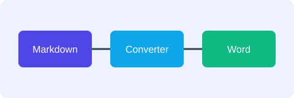
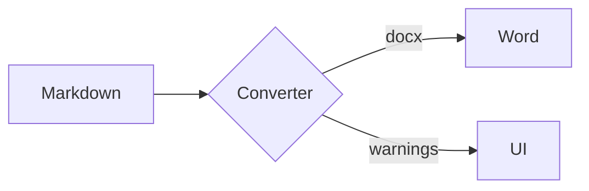
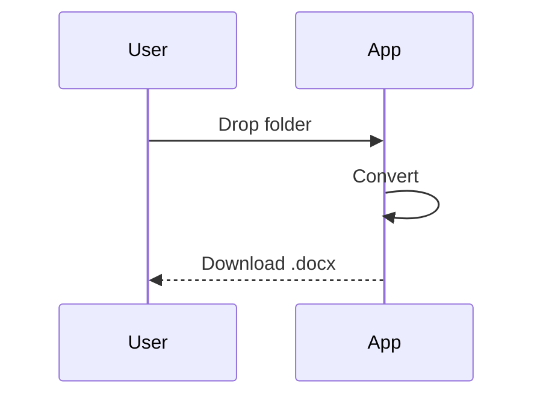

# Feature Tour

This paragraph is soft-wrapped in the source
but should read as one line in Word. It has **bold**, *italic*, ***both***,
~~strikethrough~~, `inline code`, an [external link](https://example.com),
a bare URL https://github.com and a jump to [the rollback plan](#rollback-plan).

## Deployment Steps

1. Apply the manifest:
   ```bash
   kubectl apply -f deploy.yaml
   kubectl rollout status deploy/api
   ```
2. Verify the pods
   - check readiness
   - check logs
     1. app logs
     2. sidecar logs
3. Announce in the channel

A second list that must restart at 1:

1. Alpha
2. Beta

And one that starts at 5:

5. Fifth
6. Sixth

## Checklist

- [x] Backup taken
- [ ] Change approved
- [ ] Monitoring dashboards open

## Quotes

> A quote with a list inside:
> - first point
> - second point
>
> > And a nested quote.

## Table

| Component | Owner | Status | Cost |
|:----------|:-----:|:------:|-----:|
| API       | Team A | ✅ Live | 1,200 |
| Worker    | Team B | 🚧 WIP  |   350 |
| Database  | Team C | ✅ Live | 4,800 |

## Images

Local SVG (converted to PNG), with its alt text as caption:



Inline image in a sentence: before  after.

HTML image tag with explicit width:

<p align="center"></p>

Missing image (should show a placeholder and a warning):


## Diagram





---

## Rollback Plan

```python
def rollback(release: str) -> None:
    print(f"Rolling back {release}")
```

Line with a hard break at the end  
next line.
